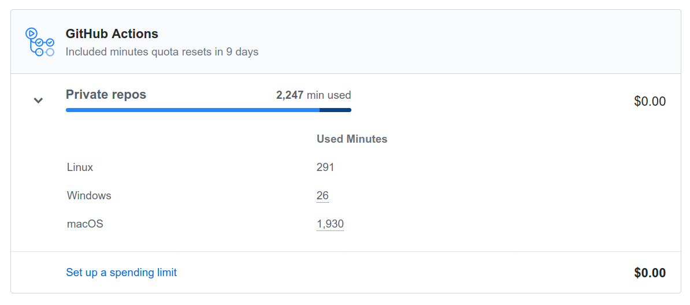
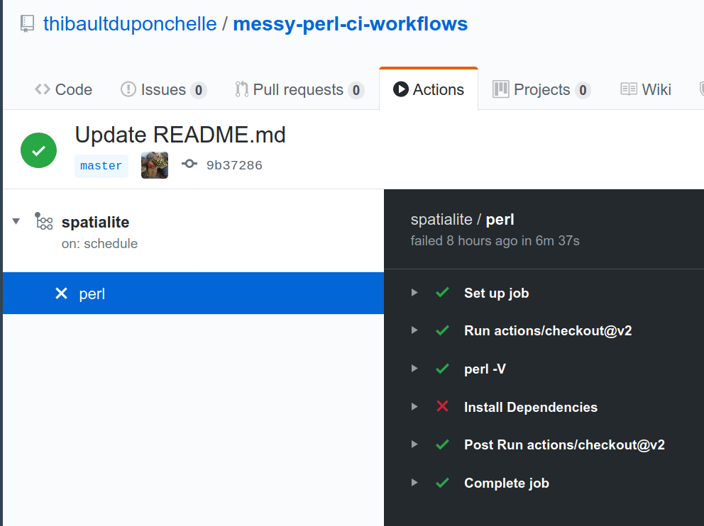
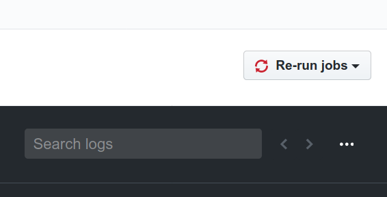
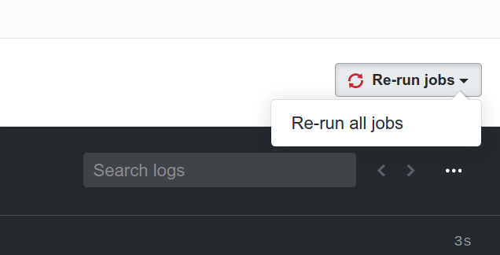

[](https://travis-ci.org/thibaultduponchelle/messy-perl-ci-workflows)
[](https://github.com/thibaultduponchelle/messy-perl-ci-workflows/actions?query=workflow%3Alinux-check-syntax)
[](https://github.com/thibaultduponchelle/messy-perl-ci-workflows/actions?query=workflow%3Alinux-github-action-install-with-cpanminus) 
[](https://github.com/thibaultduponchelle/messy-perl-ci-workflows/actions?query=workflow%3Alinux-github-action-install-with-cpm) 
[](https://github.com/thibaultduponchelle/messy-perl-ci-workflows/actions?query=workflow%3Alinux-perl-container-cpm) 
[](https://github.com/thibaultduponchelle/messy-perl-ci-workflows/actions?query=workflow%3Alinux-with-perl-setup-and-cpm) 
[](https://github.com/thibaultduponchelle/messy-perl-ci-workflows/actions?query=workflow%3Amacos-cpm) 
[](https://github.com/thibaultduponchelle/messy-perl-ci-workflows/actions?query=workflow%3Amacos-perl-container-cpm) 
[](https://github.com/thibaultduponchelle/messy-perl-ci-workflows/actions?query=workflow%3Amacos-share-cpanminus) 
[](https://github.com/thibaultduponchelle/messy-perl-ci-workflows/actions?query=workflow%3Amacos-share-cpm) 
[](https://github.com/thibaultduponchelle/messy-perl-ci-workflows/actions?query=workflow%3Amacos-system-cpanminus) 
[](https://github.com/thibaultduponchelle/messy-perl-ci-workflows/actions?query=workflow%3Amacos-system-cpm) 
[](https://github.com/thibaultduponchelle/messy-perl-ci-workflows/actions?query=workflow%3Anightly-build) 
[](https://github.com/thibaultduponchelle/messy-perl-ci-workflows/actions?query=workflow%3Aperl-critic) 
[](https://github.com/thibaultduponchelle/messy-perl-ci-workflows/actions?query=workflow%3Aplack) 
[](https://github.com/thibaultduponchelle/messy-perl-ci-workflows/actions?query=workflow%3Awindows-cpanminus) 
[](https://github.com/thibaultduponchelle/messy-perl-ci-workflows/actions?query=workflow%3Awindows-cpm) 
[](https://github.com/thibaultduponchelle/messy-perl-ci-workflows/actions?query=workflow%3Axml-libxml) 
[](https://github.com/thibaultduponchelle/messy-perl-ci-workflows/actions?query=workflow%3Awebframeworks) 
[](https://github.com/thibaultduponchelle/messy-perl-ci-workflows/actions?query=workflow%3Atemplating) 
[](https://github.com/thibaultduponchelle/messy-perl-ci-workflows/actions?query=workflow%3Amess) 
[](https://github.com/thibaultduponchelle/messy-perl-ci-workflows/actions?query=workflow%3Aperl-5.6.2-on-recent-ubuntu) 
[](https://github.com/thibaultduponchelle/messy-perl-ci-workflows/actions?query=workflow%3Aperl-5.8.9-on-recent-ubuntu) 
[](https://github.com/thibaultduponchelle/messy-perl-ci-workflows/actions?query=workflow%3Aperl-5.10.1-on-recent-ubuntu) 
[](https://github.com/thibaultduponchelle/messy-perl-ci-workflows/actions?query=workflow%3Aalien-almost-all-1) 
[](https://github.com/thibaultduponchelle/messy-perl-ci-workflows/actions?query=workflow%3Aalien-almost-all-2) 
[](https://github.com/thibaultduponchelle/messy-perl-ci-workflows/actions?query=workflow%3Aalien-almost-all-3) 
[](https://github.com/thibaultduponchelle/messy-perl-ci-workflows/actions?query=workflow%3Aalien-almost-all-4) 
[](https://github.com/thibaultduponchelle/messy-perl-ci-workflows/actions?query=workflow%3Aalien-almost-all-5) 
[](https://github.com/thibaultduponchelle/messy-perl-ci-workflows/actions?query=workflow%3Aalien-almost-all-6-problem-childs) 
[](https://github.com/thibaultduponchelle/messy-perl-ci-workflows/actions?query=workflow%3Aalien-river-only-1) 
[](https://github.com/thibaultduponchelle/messy-perl-ci-workflows/actions?query=workflow%3Aalien-river-only-2) 
[](https://github.com/thibaultduponchelle/messy-perl-ci-workflows/actions?query=workflow%3Aalien-river-only-3) 
[](https://github.com/thibaultduponchelle/messy-perl-ci-workflows/actions?query=workflow%3Aalien-river-only-4) 
[](https://github.com/thibaultduponchelle/messy-perl-ci-workflows/actions?query=workflow%3Aalien-river-only-5-problem-childs) 
[](https://github.com/thibaultduponchelle/messy-perl-ci-workflows/actions?query=workflow%3Amultiple-runs-of-cpm) 
[](https://github.com/thibaultduponchelle/messy-perl-ci-workflows/actions?query=workflow%3Amultiple-runs-of-cpm-global) 
[](https://github.com/thibaultduponchelle/messy-perl-ci-workflows/actions?query=workflow%3Aproblem-childs) 
[](https://github.com/thibaultduponchelle/messy-perl-ci-workflows/actions?query=workflow%3Aspatialite) 
[](https://github.com/thibaultduponchelle/messy-perl-ci-workflows/actions?query=workflow%3Asodium) 


# Messy Perl ci workflows

(this not Perl that is messy :grinning:)

## General

This is a repository to give some inspiration to my Perl fellow developers.

I use it also as a ci playground for testing.

### Docker images

- [official docker images](https://hub.docker.com/_/perl) from [docker-perl repo](https://github.com/Perl/docker-perl)
- [houseabsolute perl images](https://hub.docker.com/r/houseabsolute/ci-perl-helpers-ubuntu)
- [my "less than 20 minutes old" perl blead](https://hub.docker.com/r/tibtibdocker/perl-blead)
- ["compilation optimized" perl image](https://hub.docker.com/r/at00mic/perl-compiler) from [at00mic perl-compiler repo](https://github.com/atoomic/perl-compiler)

## Github actions workflows

First check [Skaji blog post about github actions for Perl](https://medium.com/@skaji/perl-meets-github-actions-3893ae100205) and [skaji github ci samples](https://github.com/skaji/perl-github-actions-sample) :smiley:

### Ready to use github actions

- [Install with cpm](https://github.com/marketplace/actions/install-with-cpanm) ([github repo](https://github.com/perl-actions/install-with-cpm))
- [Install with cpanm](https://github.com/marketplace/actions/install-with-cpanm) ([github repo](https://github.com/perl-actions/install-with-cpanm))
- [Setup Perl Environment](https://github.com/marketplace/actions/setup-perl-environment) ([github repo](https://github.com/shogo82148/actions-setup-perl))
- [Perl Critic](https://github.com/marketplace/actions/github-action-for-perl-critic) ([github repo](https://github.com/Difegue/action-perlcritic))

### Examples 

#### Install/test/lint modules
- [windows and cpanm (do not use helper action for it)](https://github.com/thibaultduponchelle/messy-perl-ci-workflows/blob/master/.github/workflows/windows-cpanminus.yml)
- [windows and cpm (do not use helper action for it)](https://github.com/thibaultduponchelle/messy-perl-ci-workflows/blob/master/.github/workflows/windows-cpm.yml)
- [build alien with cpanminus on macos](https://github.com/thibaultduponchelle/messy-perl-ci-workflows/blob/master/.github/workflows/macos-share-cpanminus.yml)
- [build alien with cpm on macos](https://github.com/thibaultduponchelle/messy-perl-ci-workflows/blob/master/.github/workflows/macos-share-cpm.yml)
- [build and test with vendor perl](https://github.com/thibaultduponchelle/messy-perl-ci-workflows/blob/master/.github/workflows/linux-vendor-cpanminus.yml)
- [perl critic](https://github.com/thibaultduponchelle/messy-perl-ci-workflows/blob/master/.github/workflows/perl-critic.yml)

#### Use perl containers 
- [matrix + perl containers](https://github.com/thibaultduponchelle/messy-perl-ci-workflows/blob/master/.github/workflows/linux-perl-container-cpm.yml)
- [use houseabsolute container](https://github.com/thibaultduponchelle/messy-perl-ci-workflows/blob/master/.github/workflows/houseabsolute.yml)
- [use official docker image 5.30.2](https://github.com/thibaultduponchelle/messy-perl-ci-workflows/blob/master/.github/workflows/official-docker.yml)
- [use perl blead](https://github.com/thibaultduponchelle/messy-perl-ci-workflows/blob/master/.github/workflows/perl-blead.yml)

#### Create perl docker images (to be used in other workflows)
- [build docker image and push to docker hub](https://github.com/thibaultduponchelle/docker-perl-blead/blob/master/.github/workflows/perl-blead.yml)
- [build docker image and push to docker hub (use helper action)](https://github.com/thibaultduponchelle/messy-perl-ci-workflows/blob/master/.github/workflows/build-docker-image-with-action.yml)
- [build docker image and push to docker hub (use another helper action)](https://github.com/thibaultduponchelle/messy-perl-ci-workflows/blob/master/.github/workflows/publish-to-docker-2.yml)

#### Other
- [build old perl on recent ubuntu](https://github.com/thibaultduponchelle/messy-perl-ci-workflows/blob/master/.github/workflows/perl-5.6.2-on-recent-ubuntu.yml)
- [test the build of all aliens](https://github.com/thibaultduponchelle/aliens-ci)
- [simple nightly build echo](https://github.com/thibaultduponchelle/messy-perl-ci-workflows/blob/master/.github/workflows/nightly-build.yml)

### Caveats

#### Limits 

There is a limit in how much github actions you can run on private repositories.
It's a matter of storage and run duration. The duration depends the platform (linux is cheap, windows is less, and macos is very expensive).



#### Containers limitation

You can only launch containers from a GNU/Linux host.
For instance, if you specify `run-on: macOS-latest`, you won't be able to use `container:` :


```
    # THIS CODE DOES NOT WORK

    runs-on: macOS-latest

    strategy:
      matrix:
        perl-version:
          - 'latest'

    container:
      image: perl:${{ matrix.perl-version }}
```

Will produce :

```
    ##[error]Container operations are only supported on Linux runners`
``` 

See for instance this [failed run](https://github.com/thibaultduponchelle/messy-perl-github-actions/runs/608005097?check_suite_focus=true)

#### Cron

Sometimes cron requires to be quoted because `*` have a special meaning in yml

You can do :
```
on:
  schedule:
    cron: 0 0 * * *
```
(every night a 0h00)

But you can't do this:

```
on:
  schedule:
    cron: */15 * * * *
```
(every 15 minutes)

You have to quote like this :
```
cron: '*/15 * * * *'
```

### Replay a job

To acccess the replay button, go in actions, select the step (here it is `perl`) :



On the right you have a new button :



Click and click again :




## Travis

### Mandatory kit 

Please note that your repository needs to include a `Build.PL`, a `Makefile.PL` or a `makefile` (with a `test` target).

Check the documentation about [Travis Perl helper](https://docs.travis-ci.com/user/languages/perl)

### Activation

You also need to activate `Travis CI` for your repository (connect to travis website with github credentials).

### Extra bits

If your Perl version gets removed suddenly, it's probably because you are attached to a *floating* platform and the *latest* changed from one Ubuntu LTS to another Ubuntu LTS (for instance).

You can fix it by forcing the platform.

#### Examples 

- [simple multi perl testing](https://github.com/thibaultduponchelle/messy-perl-ci-workflows/blob/master/.travis.yml)
- [caching + alien install](https://github.com/plicease/Alien-Expat/blob/master/.travis.yml) 

## Appveyor

### Examples 

- [build an alien](https://github.com/plicease/Alien-Expat/blob/master/.appveyor.yml)


## Azure Pipelines

Check this [house absolute blog post](https://blog.urth.org/2019/11/18/my-new-ci-helpers-for-perl/)

### Helpers 

See [houseabsolute ci helpers](https://github.com/houseabsolute/ci-perl-helpers) 

### Examples

- [build windows linux macos + coverage](https://github.com/houseabsolute/test-class-moose/blob/master/azure-pipelines.yml)


## Other

- [cip helpers (travis, github actions...)](https://github.com/plicease/cip)

## Badges and releasing tools

Dist::Zilla, Minilla and friends obviously support adding badges to your README.md !
- [Dist::Zilla badges plugin](https://metacpan.org/pod/Dist::Zilla::Plugin::GitHubREADME::Badge)
- [Minilla badges](https://metacpan.org/pod/Minilla#badges)


## Notes 

### Check syntax

Executing `perl -c` on file could actually run them partially (`BEGIN` blocks...).

## Resources
